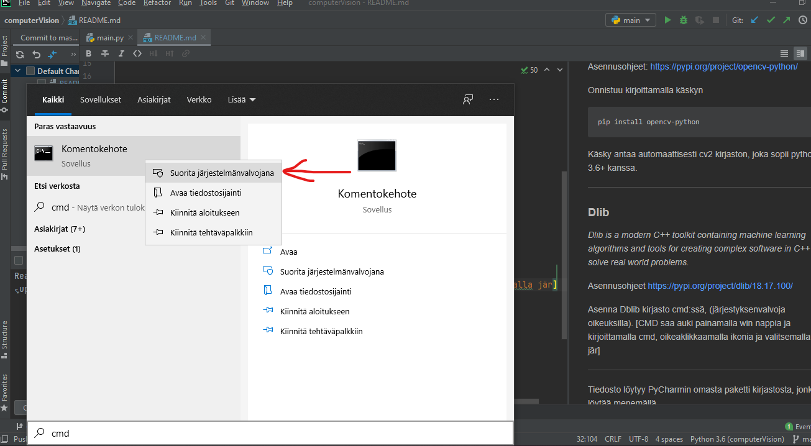
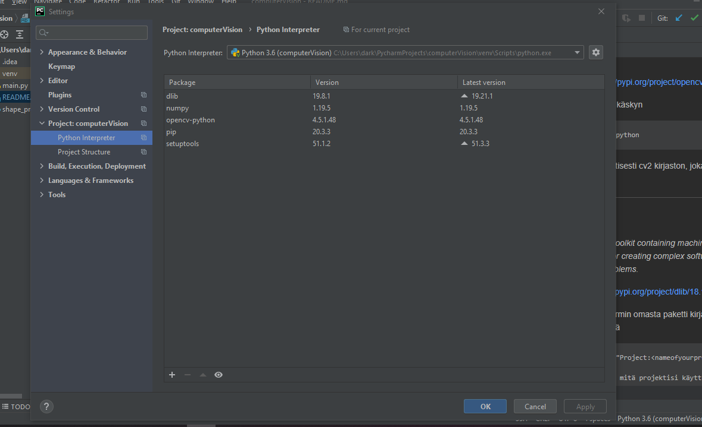
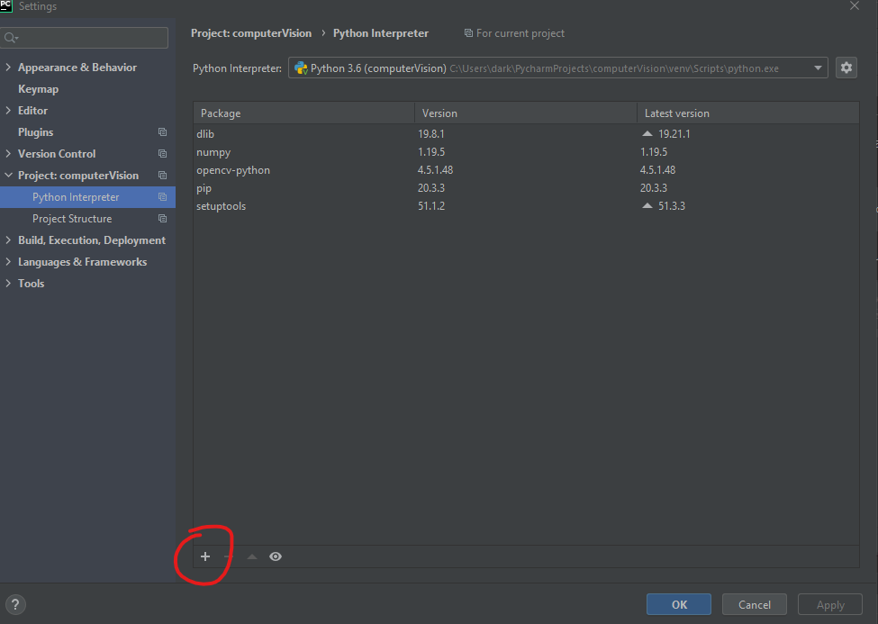
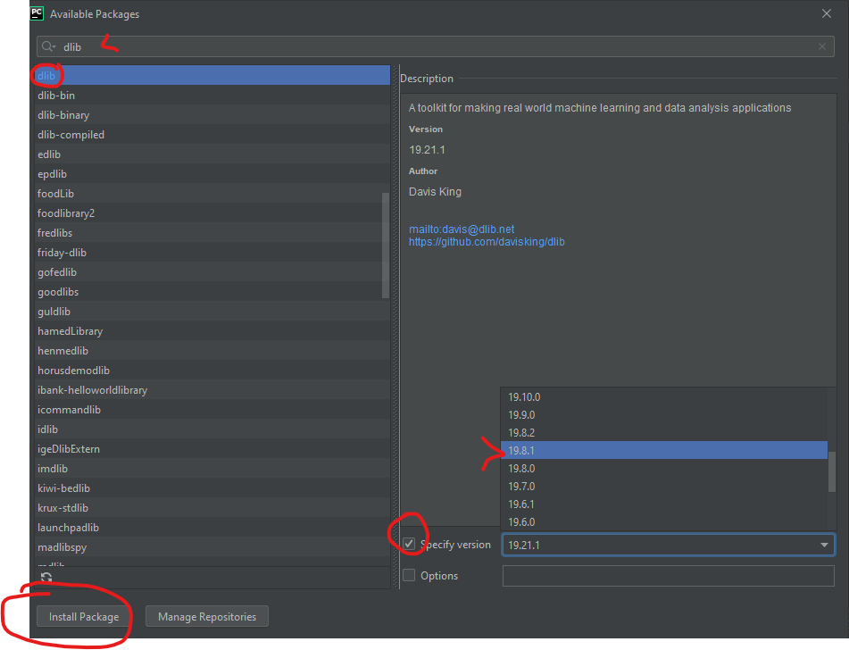

##Installing libraries

Ennen aloitusta tarkista että Pip install on päivitetty mahdollisimman uuteen versioon
````shell
pip install --upgrade
````
___
###Numpy
<span style="color:orange">*NumPy is a library to add support for large, multi-dimensional arrays and matrices, along with a large collection of high-level mathematical functions to operate on these arrays.*</span>.</p>

Tämä löytyy hyvin todennäköisesti jo koneelta, mutta jos ei löydy sen saa asennettua käskyllä:

````
pip install numpy
````
___
###OpenCV 2
<span style="color:orange">*OpenCV is a cross-platform library using which we can develop real-time computer vision applications. 
It mainly focuses on image processing, video capture and analysis including features like face detection 
and object detection.*</span>.</p>

Asennusohjeet: https://pypi.org/project/opencv-python/


Onnistuu kirjoittamalla käskyn
```shell
pip install opencv-python
``` 
Käsky antaa automaattisesti cv2 kirjaston, joka sopii python 3.6+ kanssa.
___
###Dlib
<span style="color:orange">*Dlib is a modern C++ toolkit containing machine learning algorithms and tools for creating 
complex software in C++ to solve real world problems.*</span>.</p>

Asennusohjeet https://pypi.org/project/dlib/18.17.100/


Asenna Dblib kirjasto cmd:ssä, (järjestyksenvalvoja oikeuksilla). 

[CMD saa auki painamalla win nappia ja kirjoittamalla cmd, oikea klikkaamalla ikonia ja valitsemalla admin]


Asennuskäskyn voi kopioida ja liittää suoraan ikkunaan
```
python -m pip install 
https://files.pythonhosted.org/packages/0e/ce/f8a3cff33ac03a8219768f0694c5d703c8e037e6aba2e865f9bae22ed63c/dlib-19.8.1-cp36-cp36m-win_amd64.whl#sha256=794994fa2c54e7776659fddb148363a5556468a6d5d46be8dad311722d54bfcf
```
___
Viimeisenä pitää tarkistaa, että IDE tunnistaa asennetut kirjastot. PyCharmissa se löytyy polkua pitkin:
```
Files > Settings > "Project:<nameofyourproject> > Project Interpreter
```

Mistä näkee paketit mitä projektisi käyttää virtuaali ympäristössään


___

##Ongelmia asennuksen kanssa

Dlib on välillä haastava asentaa riippuen järjestelmä, IDE ja käyttöjärjestelmä yhdistelmästä. Jos aikaisemmin
kuvattu tapa ei tuottanut haluttua tulosta voit kokeilla PyCharmin omaa paketti jako kanavaa.
Sijainti on sama kuin aijemmin mainittu Project Interpreter, mutta tällä kertaa painat plus merkkiä
ikkunan alakulmassa.
```
Files > Settings > "Project:<nameofyourproject> > Project Interpreter
```



1. Kirjoita haku ikkunaan Dlib ja valitse paketti
2. Valitse "Specify version" ja valitse 19.8.1
3. Asenna paketti 
4. Tarkista uudestaan Project Interpreter löytääkö IDE tarvittavat paketit




